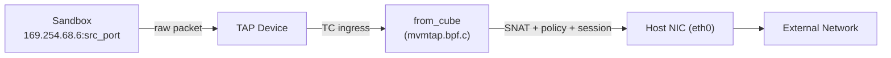
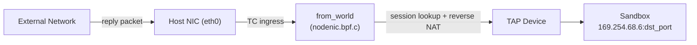
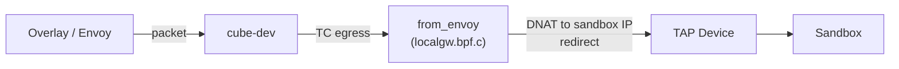
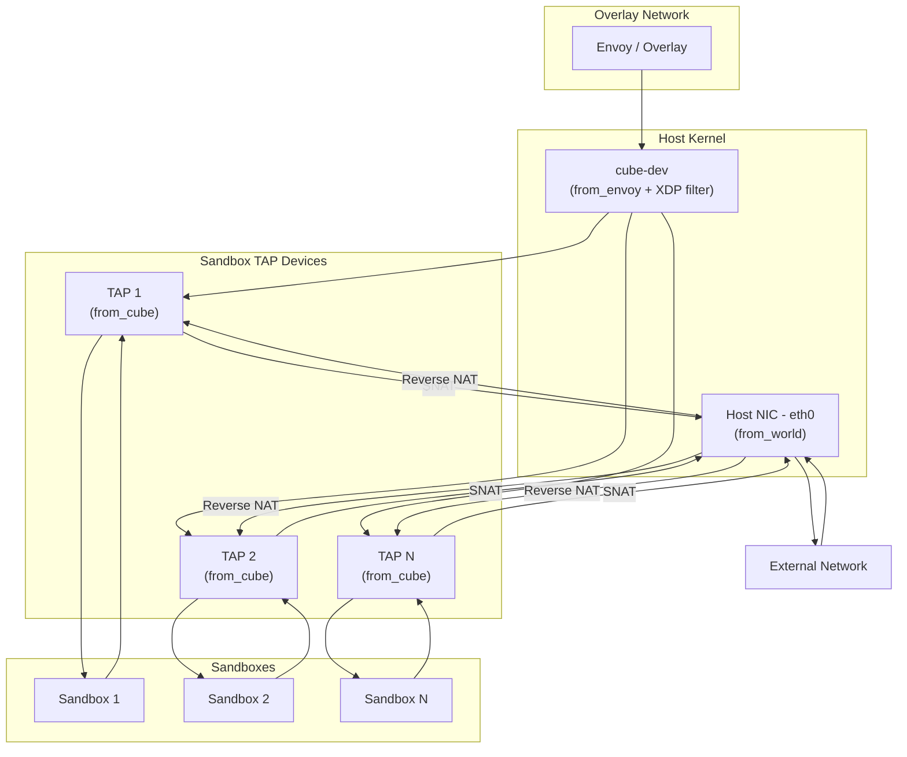

CubeVS is the network virtualization layer inside CubeSandbox. It isolates each sandbox with its own virtual network, giving every instance private, low-latency connectivity to the outside world while enforcing per-sandbox security policies entirely in kernel space. CubeVS is composed of three eBPF programs, a set of shared BPF maps, and a Go control-plane library — together replacing traditional Linux networking stacks (bridges, OVS, iptables) with a leaner, per-packet kernel-space pipeline.

## Design goals

Traditional container networking stacks add per-packet overhead that grows with the number of tenants on a host. CubeVS is built around three principles:

- **Point-to-point low latency** — Each sandbox communicates through a dedicated TAP device. There is no shared bridge and no software switch hop.
- **Kernel-space policy enforcement** — Network policies are evaluated in eBPF before a packet ever reaches userspace, keeping CPU overhead minimal.
- **Scalable NAT** — SNAT port allocation uses a lock-protected pool with collision-resistant insertion, avoiding the iptables rule explosion that plagues large deployments.

## The three BPF programs

CubeVS attaches one BPF program to each of the three network boundaries a packet can cross on a host:

| Program | File | Attach point | Direction | Role |
|---|---|---|---|---|
| `from_cube` | `mvmtap.bpf.c` | TC ingress on each TAP device | Sandbox → Host | SNAT, policy check, session creation, ARP proxy |
| `from_world` | `nodenic.bpf.c` | TC ingress on host NIC (eth0) | External → Host | Reverse NAT, port-mapping proxy |
| `from_envoy` | `localgw.bpf.c` | TC egress on cube-dev | Overlay → Sandbox | DNAT overlay traffic to sandbox IP, redirect to TAP |

A fourth lightweight program — `filter_from_cube` — is attached via XDP on cube-dev. It serves as an early-reject filter, dropping unsolicited inbound TCP and UDP packets before they enter the TC layer, while still allowing ICMP and packets that belong to existing sessions.

## BPF maps

Nine pinned BPF maps (under `/sys/fs/bpf/`) form the shared state between the three programs and the Go control plane:

| Map | Type | Key | Value | Purpose |
|---|---|---|---|---|
| `mvmip_to_ifindex` | Hash | Sandbox IP | TAP ifindex | IP-to-device lookup |
| `ifindex_to_mvmmeta` | Hash | TAP ifindex | Sandbox metadata (IP, ID, version) | Device-to-metadata lookup |
| `egress_sessions` | Hash | 5-tuple (sandbox side) | NAT session state | Track outbound connections |
| `ingress_sessions` | Hash | 5-tuple (external side) | Reverse-lookup metadata | Map reply packets back to sandbox |
| `snat_iplist` | Array | Index (0–3) | SNAT IP entry (IP, ifindex, port waterline) | SNAT IP pool |
| `allow_out` | Hash-of-Maps | TAP ifindex | Inner LPM trie (destination CIDRs) | Per-sandbox allow list |
| `deny_out` | Hash-of-Maps | TAP ifindex | Inner LPM trie (destination CIDRs) | Per-sandbox deny list |
| `remote_port_mapping` | Hash | Host port | TAP ifindex + sandbox listen port | Inbound port forwarding |
| `local_port_mapping` | Hash | TAP ifindex + sandbox listen port | Host port | Outbound port-mapping optimization |

Maps are pinned so that programs loaded at different times (for example, per-TAP filters loaded after `Init()`) can share state through the filesystem path.

## Traffic flows

### Egress: sandbox to external network

When a sandbox process opens a connection to the internet, the packet takes this path:



1. The sandbox sends a packet with source IP `169.254.68.6` and a port chosen by its TCP/UDP stack.
2. The packet enters the TAP device and hits the `from_cube` TC ingress filter.
3. `from_cube` checks whether the destination is the sandbox gateway (`169.254.68.5`). If so, it DNATs the destination to cube-dev and redirects the packet there (overlay path).
4. For all other destinations, `from_cube` evaluates the network policy, creates or updates a NAT session in `egress_sessions` and `ingress_sessions`, performs SNAT (replacing the sandbox source IP and port with one from the SNAT pool), and redirects the rewritten packet to the host NIC.

### Ingress: external network to sandbox

Reply packets and port-mapped inbound connections arrive at the host NIC and are routed back to the correct sandbox:



`from_world` handles two cases:

- **Session-based reverse NAT** — The filter looks up the packet's 5-tuple in `ingress_sessions`. On a match, it reconstructs the original sandbox-side 5-tuple, performs reverse DNAT (rewriting destination IP and port back to the sandbox's internal address), and redirects the packet to the correct TAP device.
- **Port-mapped proxy** — If no session matches, the filter checks `remote_port_mapping` using the destination port. A match means this is an inbound connection to a service the sandbox is exposing. The filter DNATs the packet to the sandbox's listen port and redirects to the TAP.

### Overlay traffic: Envoy to sandbox

Traffic arriving from the overlay network enters through cube-dev:



`from_envoy` rewrites the destination IP from the overlay address to the sandbox's internal IP (`169.254.68.6`), sets the source to the gateway IP (`169.254.68.5`), and redirects the packet to the appropriate TAP device using `mvmip_to_ifindex`.

## Session tracking

CubeVS maintains stateful connection tracking so that reply packets can be correctly reverse-NATed and stale connections can be cleaned up.

<AccordionGroup>
  <Accordion title="Dual-map design">
    Two maps work in tandem:

    - **`egress_sessions`** is the primary session table. The key is the original 5-tuple as seen from the sandbox side (sandbox IP, destination IP, sandbox port, destination port, protocol, and a version field for multi-version support). The value holds full NAT state: SNAT IP and port, TAP ifindex, timestamps, TCP state, and an active-close flag.
    - **`ingress_sessions`** is the reverse-lookup table. The key is the 5-tuple as seen from the external side (external IP, node IP, external port, SNAT port, protocol). The value stores just enough information (sandbox IP, sandbox port, version) to reconstruct the `egress_sessions` key and perform reverse NAT.

    This dual-map approach avoids duplicating the full session state in both directions while still enabling O(1) lookups from either side of the connection.
  </Accordion>
  <Accordion title="TCP state machine">
    CubeVS implements a TCP connection-tracking state machine modeled after the Linux kernel's `nf_conntrack`. It recognizes 11 states: `SYN_SENT`, `SYN_RECV`, `ESTABLISHED`, `FIN_WAIT`, `CLOSE_WAIT`, `LAST_ACK`, `TIME_WAIT`, `CLOSE`, and `SYN_SENT2` (for simultaneous open). State transitions are driven by TCP flags observed in both the original (sandbox-to-external) and reply (external-to-sandbox) directions.

    Accurate state tracking serves two purposes:

    1. **Accurate timeouts** — An `ESTABLISHED` session can safely live for hours (default: 3 hours), while a half-open `SYN_SENT` session is reaped after 1 minute.
    2. **Active-close detection** — When the sandbox sends the first FIN, the session enters `TIME_WAIT` and lingers briefly to absorb retransmissions. When the external side initiates close, the session enters `CLOSE_WAIT` / `LAST_ACK` with shorter timeouts.
  </Accordion>
  <Accordion title="UDP and ICMP tracking">
    **UDP** uses a two-state model:
    - `UNREPLIED` — set when the first outbound packet is seen; 30-second timeout.
    - `REPLIED` — set when the first reply arrives; timeout extends to 180 seconds.

    **ICMP** also uses `UNREPLIED` / `REPLIED` with a fixed 30-second timeout. The ICMP echo identifier serves as the "port" in the session key, so concurrent pings from the same sandbox are tracked independently.
  </Accordion>
  <Accordion title="Session reaper">
    A Go background goroutine runs every 5 seconds and walks the `egress_sessions` map. For each session it compares `now - access_time` against a state-specific timeout:

    | Protocol | State | Timeout |
    |---|---|---|
    | TCP | SYN_SENT, SYN_RECV | 1 minute |
    | TCP | ESTABLISHED | 3 hours |
    | TCP | FIN_WAIT, CLOSE_WAIT, LAST_ACK | 1–2 minutes |
    | TCP | TIME_WAIT, CLOSE | 10 seconds |
    | UDP | UNREPLIED | 30 seconds |
    | UDP | REPLIED | 180 seconds |
    | ICMP | Any | 30 seconds |

    When a session expires, the reaper deletes both the `egress_sessions` and `ingress_sessions` entries. If the session was not in a normal terminal state (for example, an `ESTABLISHED` entry timing out without a FIN), the reaper logs a warning. It also monitors session count and alerts when occupancy exceeds 80% of map capacity.
  </Accordion>
</AccordionGroup>

## SNAT

Every outbound packet from a sandbox must be rewritten with a routable source address before it can leave the host. CubeVS performs this in `from_cube` using a pool of up to four SNAT IPs.

<AccordionGroup>
  <Accordion title="IP selection">
    IP selection is deterministic per sandbox: `index = jhash(sandbox_ip) % 4`. This ensures that all connections from the same sandbox use the same SNAT IP, which simplifies external firewall rules and logging.
  </Accordion>
  <Accordion title="Port allocation">
    Port allocation uses a monotonically increasing waterline per SNAT IP entry. The waterline starts at port 30000 and increments with each new connection. When it reaches 65535 it wraps around. Each SNAT entry is protected by a BPF spin lock so concurrent allocations on different CPUs do not race.
  </Accordion>
  <Accordion title="Collision avoidance">
    After selecting a port, the BPF program attempts to insert the reverse-lookup entry into `ingress_sessions` using the `BPF_NOEXIST` flag. If the key already exists (another session is already using that SNAT IP:port combination for the same external endpoint), the allocator increments the port and retries, up to 10 attempts. If all 10 fail, the packet is dropped.

    After a successful allocation, `from_cube` updates the IP header (source IP and checksum) and the transport header (source port and checksum) in place, then redirects the packet to the host NIC.
  </Accordion>
</AccordionGroup>

## Network policy

CubeVS enforces per-sandbox outbound network policies entirely in kernel space using LPM (Longest Prefix Match) tries for CIDR-based rules.

Each sandbox can have two LPM tries associated with its TAP device:

- **`allow_out`** — An allow list of destination CIDRs. If this map exists and the destination matches, the packet is allowed regardless of the deny list.
- **`deny_out`** — A deny list of destination CIDRs. If this map exists and the destination matches (and was not in the allow list), the packet is dropped.

Both are implemented as hash-of-maps: the outer map is keyed by TAP ifindex, and each value is an inner LPM trie. This per-device structure means that policy updates for one sandbox do not require locking maps belonging to other sandboxes.

### Evaluation order

```
1. Is the destination the sandbox gateway (169.254.68.5)?
   --> YES: Allow (internal traffic, always permitted)

2. Does the sandbox have an allow_out map, and does the destination match?
   --> YES: Allow

3. Does the sandbox have a deny_out map, and does the destination match?
   --> YES: Drop

4. Default: Allow
```

The priority is **allow > deny > default-allow**. A sandbox operator can set a broad deny rule (for example, `0.0.0.0/0` to block all internet access) and then punch specific holes with allow rules.

### Always-denied CIDRs

Regardless of policy configuration, CubeVS prevents sandboxes from reaching private and link-local address ranges. These CIDRs are added to the deny list during `AddTAPDevice()` and cannot be overridden by allow rules:

- `10.0.0.0/8`
- `127.0.0.0/8`
- `169.254.0.0/16`
- `172.16.0.0/12`
- `192.168.0.0/16`

This ensures a sandbox cannot probe the host's internal network or other sandboxes' link-local addresses.

<Note>
  Policies are configured via the `MVMOptions` struct passed to `AddTAPDevice()`: set `AllowInternetAccess: false` to install a blanket deny rule (`0.0.0.0/0`), then use `AllowOut` and `DenyOut` to specify CIDR lists. Policies can be updated at runtime by modifying the inner LPM tries without detaching or reloading BPF programs.
</Note>

## Port mapping

Sandboxes are not directly reachable from outside the host. When a sandbox needs to expose a service, CubeVS provides port mapping — a static NAT rule that forwards traffic arriving at a specific host port to a specific sandbox port.

### Dual BPF maps

Two BPF maps support port mapping:

- **`remote_port_mapping`** maps a host port to a (TAP ifindex, sandbox listen port) pair. Used by `from_world` to route inbound connections to the right sandbox.
- **`local_port_mapping`** maps (TAP ifindex, sandbox listen port) back to the host port. Used by `from_cube` as an optimization: when a sandbox sends a packet from a mapped listen port, the filter skips full NAT session creation and directly SNATs the packet to the node IP with the correct port.

### Inbound proxy flow

1. An external client sends a packet to `node_ip:host_port`.
2. `from_world` looks up `remote_port_mapping[host_port]`.
3. On a match, the filter rewrites the destination to `169.254.68.6:sandbox_listen_port` and redirects to the TAP device.
4. The sandbox receives the connection on its listen port.

This path does not create entries in the session tables, keeping the maps lean for long-lived service connections.

### Management API

The Go control plane exposes four functions for managing port mappings at runtime:

| Function | Description |
|---|---|
| `AddPortMapping()` | Register a new host-port → sandbox-port mapping |
| `DelPortMapping()` | Remove an existing mapping |
| `ListPortMapping()` | List all active mappings for a sandbox |
| `GetPortMapping()` | Look up the host port assigned to a specific sandbox listen port |

## ARP proxy

Sandboxes are assigned the link-local IP `169.254.68.6` and use `169.254.68.5` as their default gateway. Since these addresses exist only inside the TAP device's point-to-point link, there is no real host at `169.254.68.5` to respond to ARP requests. CubeVS solves this with an ARP proxy built into the `from_cube` filter.

When the sandbox's network stack sends an ARP request ("Who has 169.254.68.5? Tell 169.254.68.6"), `from_cube` detects it, swaps the sender and target IP addresses to form an ARP reply, and fills in the sender MAC with the cube-dev gateway MAC address. The reply is redirected back out the same TAP device, arriving at the sandbox as if a real gateway had responded.

The sandbox then has a valid ARP entry for its default gateway and can send IP packets to any destination. Those packets are routed through the TAP, intercepted by `from_cube`, SNATed, and forwarded to the host NIC.

<Note>
  CubeVS does not use a bridge — each TAP is an isolated point-to-point link. The ARP proxy is the minimal mechanism needed to make IP routing work over this link without introducing any broadcast domain or shared L2 segment.
</Note>

## Full architecture diagram

The three BPF programs together form a complete in-kernel data path between sandboxes and the outside world:



The key design principles are:

- **All data-path logic in kernel space** — Policy evaluation, NAT, session tracking, and ARP resolution happen in eBPF with no context switches to userspace.
- **Per-sandbox isolation** — Each sandbox has its own TAP device, its own policy tries, and its own sessions. There is no shared bridge or switch.
- **Stateful connection tracking** — A dual-map session model (`egress_sessions` + `ingress_sessions`) enables bidirectional NAT with O(1) lookups and accurate protocol-aware timeouts.
- **Minimal control plane** — The Go library handles initialization, device lifecycle, and periodic session cleanup. The steady-state data path is entirely in eBPF.
